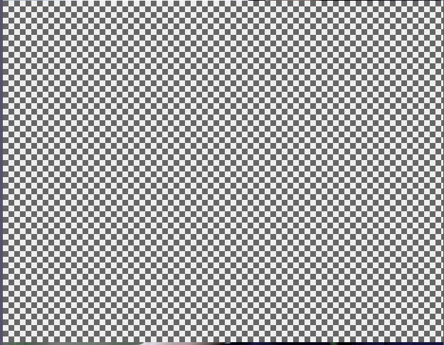

# 扩展示例代码

利用我们目前为止所学到的知识，我们现在可以写一个 Wayland 客户端，以在屏幕上显示一些东西。下面的代码是一个完整的 Wayland 应用程序，它可以打开一个 XDG 顶层窗口，并在上面显示一个 640x480 像素的棋盘格。



可以像这样编译它：

```bash
wayland-scanner private-code \
  < /usr/share/wayland-protocols/stable/xdg-shell/xdg-shell.xml \
  > xdg-shell-protocol.c
wayland-scanner client-header \
  < /usr/share/wayland-protocols/stable/xdg-shell/xdg-shell.xml \
  > xdg-shell-client-protocol.h
cc -o client client.c xdg-shell-protocol.c -lwayland-client -lrt
```

然后运行 `./client` 来查看其情况，或者运行 `WAYLAND_DEBUG=1 ./client` 来包含更多有用的调试信息。在未来的章节中，我们将在这个客户端的基础上进行开发，所以要将这些代码妥善保管。

```c
#define _POSIX_C_SOURCE 200112L
#include <errno.h>
#include <fcntl.h>
#include <limits.h>
#include <stdbool.h>
#include <string.h>
#include <sys/mman.h>
#include <time.h>
#include <unistd.h>
#include <wayland-client.h>
#include "xdg-shell-client-protocol.h"

/* Shared memory support code */
static void
randname(char *buf)
{
    // 返回一个随机的名字
    struct timespec ts;
    clock_gettime(CLOCK_REALTIME, &ts);
    long r = ts.tv_nsec;
    for (int i = 0; i < 6; ++i) {
        buf[i] = 'A'+(r&15)+(r&16)*2;
        r >>= 5;
    }
}

static int
create_shm_file(void)
{
    int retries = 100;
    do {
        char name[] = "/wl_shm-XXXXXX";
        randname(name + sizeof(name) - 7);
        --retries;
        int fd = shm_open(name, O_RDWR | O_CREAT | O_EXCL, 0600);
        if (fd >= 0) {
            shm_unlink(name);
            return fd;
        }
    } while (retries > 0 && errno == EEXIST);
    return -1;
}

static int
allocate_shm_file(size_t size)
{
    int fd = create_shm_file();
    if (fd < 0)
        return -1;
    int ret;
    do {
        /* 
        * 关于 ftruncate 的内容可以参考
        * https://www.man7.org/linux/man-pages/man3/ftruncate.3p.html
        */
        ret = ftruncate(fd, size);
    } while (ret < 0 && errno == EINTR);
    if (ret < 0) {
        close(fd);
        return -1;
    }
    return fd;
}

/* Wayland code */
struct client_state {
    /* Globals */
    struct wl_display *wl_display;
    struct wl_registry *wl_registry;
    struct wl_shm *wl_shm;
    struct wl_compositor *wl_compositor;
    struct xdg_wm_base *xdg_wm_base;
    /* Objects */
    struct wl_surface *wl_surface;
    struct xdg_surface *xdg_surface;
    struct xdg_toplevel *xdg_toplevel;
};

static void
wl_buffer_release(void *data, struct wl_buffer *wl_buffer)
{
    /* Sent by the compositor when it's no longer using this buffer */
    wl_buffer_destroy(wl_buffer);
}

static const struct wl_buffer_listener wl_buffer_listener = {
    .release = wl_buffer_release,
};

static struct wl_buffer *
draw_frame(struct client_state *state)
{
    const int width = 640, height = 480;
    int stride = width * 4;
    int size = stride * height;

    int fd = allocate_shm_file(size);
    if (fd == -1) {
        return NULL;
    }

    uint32_t *data = mmap(NULL, size,
            PROT_READ | PROT_WRITE, MAP_SHARED, fd, 0);
    if (data == MAP_FAILED) {
        close(fd);
        return NULL;
    }

    // 创建一个共享内存池
    struct wl_shm_pool *pool = wl_shm_create_pool(state->wl_shm, fd, size);

    // 创建一个缓冲区 
    struct wl_buffer *buffer = wl_shm_pool_create_buffer(pool, 0,
            width, height, stride, WL_SHM_FORMAT_XRGB8888);
    wl_shm_pool_destroy(pool);
    close(fd);

    /* Draw checkerboxed background */
    for (int y = 0; y < height; ++y) {
        for (int x = 0; x < width; ++x) {
            if ((x + y / 8 * 8) % 16 < 8)
                data[y * width + x] = 0xFF666666;
            else
                data[y * width + x] = 0xFFEEEEEE;
        }
    }

    munmap(data, size);

    // 添加监听器用于检测释放缓冲区的事件
    wl_buffer_add_listener(buffer, &wl_buffer_listener, NULL);
    return buffer;
}

static void
xdg_surface_configure(void *data,
        struct xdg_surface *xdg_surface, uint32_t serial)
{
    struct client_state *state = data;

    // 返回一个 ack_configure 以示确认
    xdg_surface_ack_configure(xdg_surface, serial);

    // 向缓冲区中绘制内容
    struct wl_buffer *buffer = draw_frame(state);

    // 将缓冲区内容附加到表面
    wl_surface_attach(state->wl_surface, buffer, 0, 0);

    // 提交表面
    wl_surface_commit(state->wl_surface);
}

static const struct xdg_surface_listener xdg_surface_listener = {
    .configure = xdg_surface_configure,
};

static void
xdg_wm_base_ping(void *data, struct xdg_wm_base *xdg_wm_base, uint32_t serial)
{
    xdg_wm_base_pong(xdg_wm_base, serial);
}

static const struct xdg_wm_base_listener xdg_wm_base_listener = {
    .ping = xdg_wm_base_ping,
};

static void
registry_global(void *data, struct wl_registry *wl_registry,
        uint32_t name, const char *interface, uint32_t version)
{
    struct client_state *state = data;

    // 绑定到全局
    if (strcmp(interface, wl_shm_interface.name) == 0) {
        state->wl_shm = wl_registry_bind(
                wl_registry, name, &wl_shm_interface, 1);
    } else if (strcmp(interface, wl_compositor_interface.name) == 0) {
        state->wl_compositor = wl_registry_bind(
                wl_registry, name, &wl_compositor_interface, 4);
    } else if (strcmp(interface, xdg_wm_base_interface.name) == 0) {
        state->xdg_wm_base = wl_registry_bind(
                wl_registry, name, &xdg_wm_base_interface, 1);
        xdg_wm_base_add_listener(state->xdg_wm_base,
                &xdg_wm_base_listener, state);
    }
}

static void
registry_global_remove(void *data,
        struct wl_registry *wl_registry, uint32_t name)
{
    /* This space deliberately left blank */
}

static const struct wl_registry_listener wl_registry_listener = {
    .global = registry_global,
    .global_remove = registry_global_remove,
};

int
main(int argc, char *argv[])
{
    // 初始化状态
    struct client_state state = { 0 };
    
    // 获取默认显示器
    state.wl_display = wl_display_connect(NULL);
    
    // 注册到默认显示器
    state.wl_registry = wl_display_get_registry(state.wl_display);
    
    // 添加事件监听
    wl_registry_add_listener(state.wl_registry, &wl_registry_listener, &state);

    // 以 wl_display 作为代理连接到混成器
    wl_display_roundtrip(state.wl_display);

    // 从混成器创建一个表面
    state.wl_surface = wl_compositor_create_surface(state.wl_compositor);

    // 从 wl_surface 创建一个 xdg_surface
    state.xdg_surface = xdg_wm_base_get_xdg_surface(
            state.xdg_wm_base, state.wl_surface);

    // 添加事件监听
    xdg_surface_add_listener(state.xdg_surface, &xdg_surface_listener, &state);

    // 获得顶层窗口
    state.xdg_toplevel = xdg_surface_get_toplevel(state.xdg_surface);

    // 设置标题
    xdg_toplevel_set_title(state.xdg_toplevel, "Example client");

    // 提交表面
    wl_surface_commit(state.wl_surface);

    while (wl_display_dispatch(state.wl_display)) {
        /* This space deliberately left blank */
    }

    return 0;
}
```